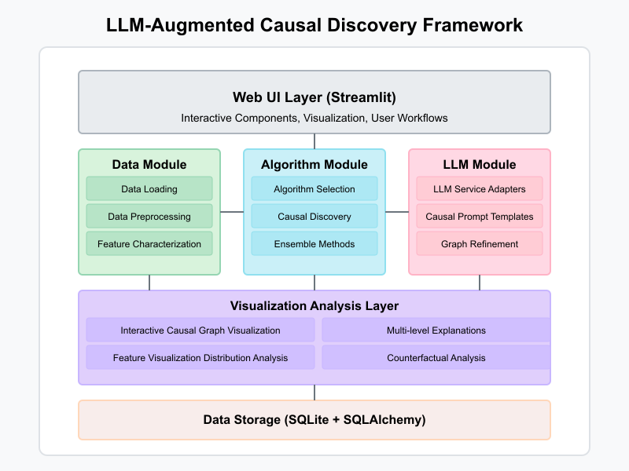

# LLM-Augmented Causal Discovery Framework

A Python-based platform for causal discovery that integrates Large Language Models with established causal discovery algorithms.

## Overview

This platform enables domain experts without specialized statistical training to:

1. Load and explore datasets
2. Run appropriate causal discovery algorithms based on data characteristics
3. Refine causal graphs using Large Language Models (LLMs)
4. Analyze and interpret causal relationships
5. Perform counterfactual analysis

## Features

- **Data Exploration**: Visualize distributions, correlations, and scatter plots
- **Algorithm Selection**: Automatically choose appropriate causal discovery algorithms based on data characteristics
- **Causal Discovery**: Execute algorithms from the CausalLearn library with sensible defaults
- **Ensemble Integration**: Combine results from multiple algorithms for more robust causal graphs
- **LLM Refinement**: Use LLMs to validate, refine, and explain causal relationships
- **Hidden Variable Discovery**: Hypothesize potential latent confounders
- **Counterfactual Analysis**: Estimate effects of interventions
- **Multi-level Explanations**: Generate explanations at different technical levels

## System Architecture



## Project Structure

This project is organized into several modules, each with its own specific functionality:

- **[App](app/README.md)**: User interface components and pages
  - **[Pages](app/pages/README.md)**: Application workflow pages
  - **[Components](app/components/README.md)**: Reusable UI elements

- **[Core](core/README.md)**: Business logic and algorithms
  - **[Algorithms](core/algorithms/README.md)**: Causal discovery algorithms
  - **[Data](core/data/README.md)**: Data handling and processing
  - **[LLM](core/llm/README.md)**: Large Language Model integration
  - **[RAG](core/rag/README.md)**: Retrieval-Augmented Generation
  - **[Visualization](core/viz/README.md)**: Data and graph visualization

- **[Database](db/README.md)**: Data persistence

- **[Utils](utils/README.md)**: Utility functions

Each module has its own README with detailed information.

## Getting Started

### Prerequisites

- Docker and Docker Compose (recommended)
- Python 3.9+ (for local installation)
- OpenAI API key or OpenRouter API key (for LLM integration)

### Installation with Docker (Recommended)

1. Clone the repository:
   ```bash
   git clone https://github.com/yourusername/causal-discovery-platform.git
   cd causal-discovery-platform
   ```

2. Create a `.env` file with your API keys:
   ```bash
   cp .env.example .env
   # Edit .env and add your API keys
   ```

   Alternatively, you can use the default OpenRouter key by running:
   ```bash
   echo "OPENROUTER_API_KEY=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" > .env
   ```

3. Build and run with Docker Compose:
   ```bash
   docker-compose up --build
   ```

4. Open your browser and navigate to:
   ```
   http://localhost:8501
   ```

### Local Installation

1. Clone the repository:
   ```bash
   git clone https://github.com/yourusername/causal-discovery-platform.git
   cd causal-discovery-platform
   ```

2. Create a virtual environment:
   ```bash
   python -m venv venv
   source venv/bin/activate  # On Windows, use: venv\Scripts\activate
   ```

3. Install dependencies:
   ```bash
   pip install -r requirements.txt
   ```

3. Set your API key (either OpenAI or OpenRouter):
   ```bash
   # For OpenAI
   export OPENAI_API_KEY=your-api-key-here  # On Windows, use: set OPENAI_API_KEY=your-api-key-here
   # OR for OpenRouter
   export OPENROUTER_API_KEY=your-openrouter-key-here
   ```

   Alternatively, create a .env file in the project root:
   ```bash
   echo "OPENROUTER_API_KEY=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" > .env
   ```

5. Run the application:
   ```bash
   streamlit run app/Welcome.py
   ```

## Usage

1. **Data Loading**:
   - Upload your dataset (CSV, Excel, Parquet)
   - Or select from sample datasets (Asia, Sachs, Insurance)

2. **Data Exploration**:
   - Visualize feature distributions
   - Examine correlations
   - Create scatter plots
   - Analyze missing values

3. **Causal Discovery**:
   - Select algorithms based on data characteristics
   - Execute algorithms individually or in ensemble
   - Visualize the resulting causal graph

4. **LLM Refinement**:
   - Configure LLM connection (OpenAI)
   - Refine the causal graph with LLM validation
   - Discover potential hidden variables
   - Compare original and refined graphs

5. **Analysis & Interpretation**:
   - Analyze causal graph structure
   - Perform counterfactual analysis
   - Generate explanations at different technical levels

## Supported Algorithms

The platform supports a variety of causal discovery algorithms from the CausalLearn library:

- PC Algorithm with variations:
  - PC + Fisher Z (continuous Gaussian data)
  - PC + Chi-square (discrete data)
  - PC + KCI (nonlinear data)

- Fast Causal Inference (FCI) for latent variables:
  - FCI + Fisher Z
  - FCI + Chi-square
  - FCI + KCI

- Greedy Equivalence Search (GES):
  - GES + BIC (continuous Gaussian data)
  - GES + BDeu (discrete data)

- LiNGAM (Linear Non-Gaussian Acyclic Models)
- GIN (Greedy Interventional Network)
- RCD (Recursive Causal Discovery)
- CAM-UV (Causal Additive Model with Unobserved Variables)

### LLM Integration

The platform supports multiple LLM providers:

1. **OpenAI**: GPT-4o, GPT-4o-mini, GPT-4-turbo, and GPT-3.5-turbo models
2. **OpenRouter**: DeepSeek R1 (free, MIT-licensed model with performance comparable to OpenAI)

The LLM is used to:

1. Validate causal edges based on statistical evidence and domain knowledge
2. Hypothesize potential hidden variables
3. Generate natural language explanations of causal relationships
4. Provide context-specific insights about the causal structure

### RAG Integration (New!)

The platform now includes Retrieval-Augmented Generation (RAG) capabilities:

1. Upload domain-specific literature (PDFs, text files)
2. Enhance LLM responses with knowledge from your documents
3. Get more accurate and domain-specific causal analyses

## Contributing

Contributions are welcome! Please feel free to submit a Pull Request.

## License

See the LICENSE file for details.

## Acknowledgments

- The platform uses the [CausalLearn](https://github.com/cmu-phil/causallearn) library for causal discovery algorithms
- LLM integration is powered by OpenAI's API
- Visualization components use Plotly and NetworkX